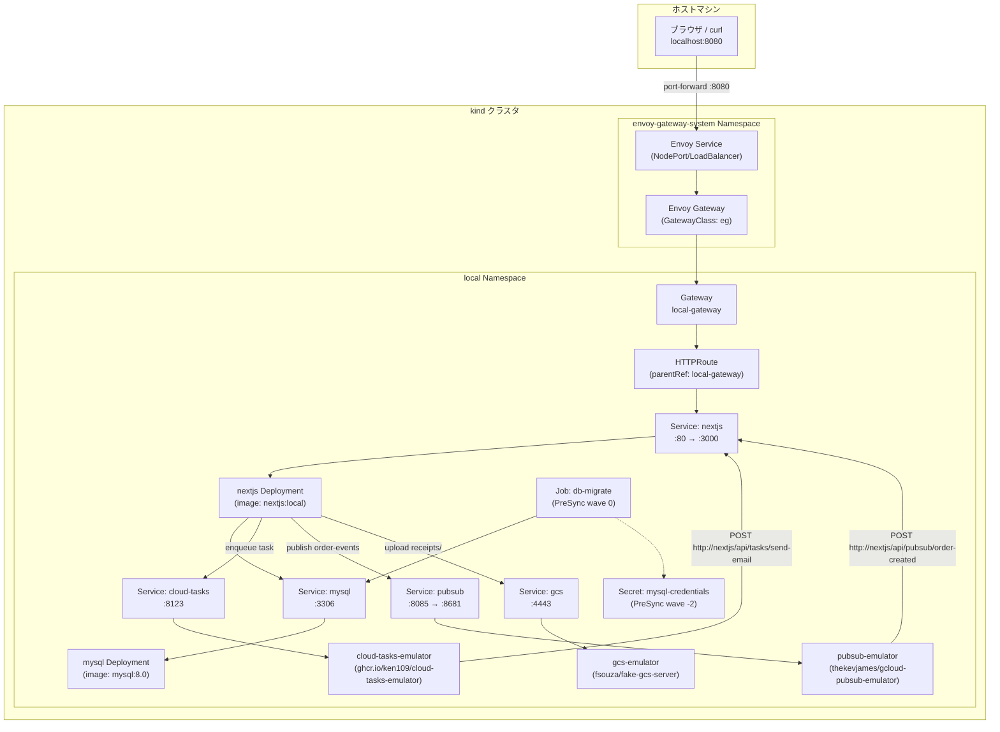
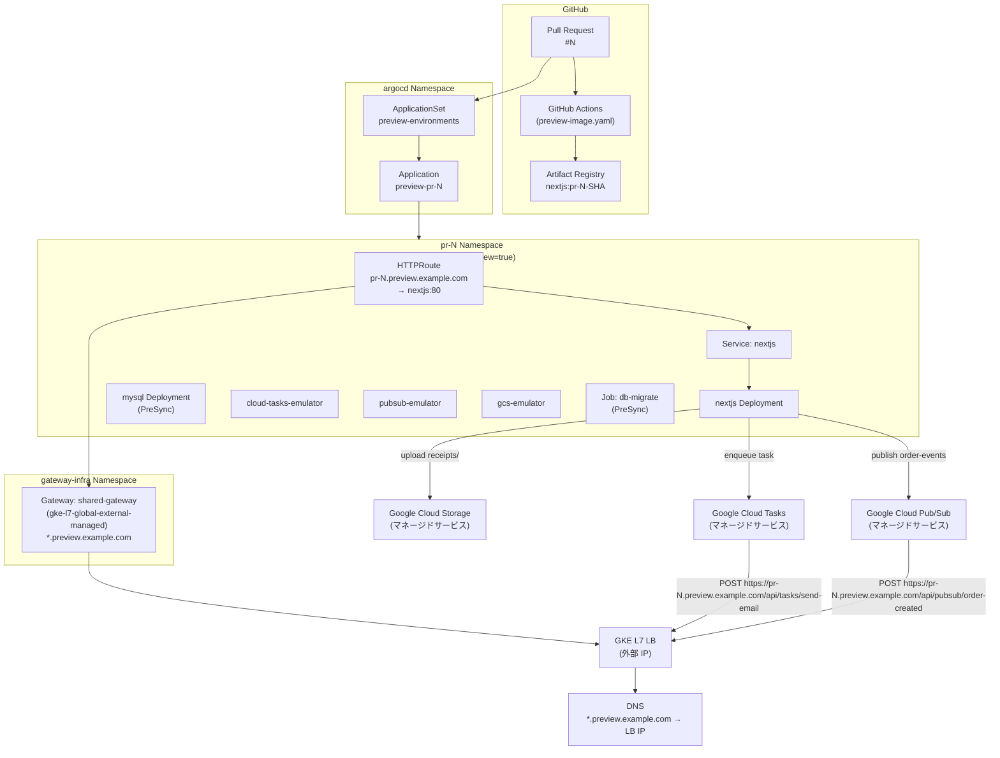
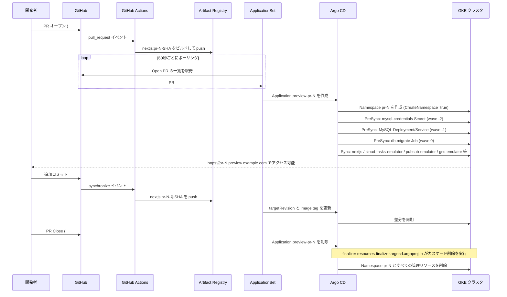

# k8s-preview-environment-sample

Next.js + MySQL + Google Cloud Tasks + Google Cloud Pub/Sub + Google Cloud Storage を使った Kubernetes Preview Environment のサンプルリポジトリです。ローカルでは kind を使って手軽に動かせ、GKE では Pull Request ごとに独立した Preview 環境を自動デプロイするテンプレートとして利用できます。

## 1. 概要

このサンプルは「注文を受け付けて Google Cloud Tasks 経由でメール送信タスクをキューに積み、Pub/Sub でイベントを配信し、Storage に領収書を保存する」という最小限のアプリケーションを題材に、以下を実現します。

- **ローカル (kind)**: Envoy Gateway + Cloud Tasks Emulator + Pub/Sub Emulator + Cloud Storage Emulator で本番と同じコードを動かす
- **GKE Preview**: Argo CD ApplicationSet の Pull Request generator が PR ごとに Namespace `pr-<番号>` へ自動デプロイし、PR Close 時にカスケード削除する

### 技術スタック

| カテゴリ | 使用技術 |
|---|---|
| アプリ | Next.js 16 (App Router)、TypeScript、React 19 |
| ビルド | Turbopack（node_modules は pnpm の prod install 成果物をそのまま同梱し Next の tracing には依存しない） |
| DB | MySQL 8.0 |
| タスクキュー | Google Cloud Tasks (HTTP ターゲット) |
| メッセージング | Google Cloud Pub/Sub (push サブスクリプション) |
| オブジェクトストレージ | Google Cloud Storage |
| コンテナランタイム | Docker (multi-stage build、Node.js 22-alpine) |
| ローカル K8s | kind |
| Gateway 実装 (kind) | Envoy Gateway v1.4.2 |
| Gateway 実装 (GKE) | GKE L7 Global External Managed (`gke-l7-global-external-managed`) |
| CD | Argo CD + ApplicationSet |
| CI | GitHub Actions + Workload Identity Federation |
| イメージレジストリ | Artifact Registry (asia-northeast1) |
| パッケージマネージャ | pnpm |

---

## 2. 全体構成図

### kind ローカル構成



### GKE Preview 環境構成



---

## 3. リポジトリ構成

```
k8s-preview-environment-sample/
├── .github/
│   └── workflows/
│       └── preview-image.yaml      # PR ごとにイメージをビルドして Artifact Registry へ push
├── app/                            # Next.js アプリケーション
│   ├── src/
│   │   ├── app/
│   │   │   ├── page.tsx            # 注文一覧・イベント・領収書表示ページ (Server Component)
│   │   │   ├── OrderForm.tsx       # 注文フォーム (Client Component)
│   │   │   ├── actions.ts          # Server Action (useActionState + createOrder)
│   │   │   ├── layout.tsx
│   │   │   └── api/
│   │   │       ├── healthz/        # ヘルスチェックエンドポイント
│   │   │       ├── orders/         # 注文作成 API (POST)
│   │   │       ├── pubsub/
│   │   │       │   └── order-created/ # Pub/Sub push サブスクリプションハンドラー (POST)
│   │   │       └── tasks/
│   │   │           └── send-email/ # Cloud Tasks ハンドラー (POST)
│   │   └── lib/
│   │       ├── db.ts               # MySQL コネクションプール
│   │       ├── cloud-tasks.ts      # Cloud Tasks クライアント (Emulator 切り替え対応)
│   │       ├── orders.ts           # 注文作成ドメインロジック
│   │       ├── pubsub.ts           # Pub/Sub クライアントとイベント発行
│   │       └── storage.ts          # Cloud Storage クライアントと領収書アップロード
│   ├── db/
│   │   ├── schema.sql              # orders / order_events テーブル定義
│   │   └── migrate.mjs             # マイグレーションスクリプト
│   ├── Dockerfile                  # multi-stage build (node:22-alpine)
│   └── package.json
├── k8s/
│   ├── base/                       # 共通 Kubernetes マニフェスト
│   │   ├── nextjs/                 # ConfigMap / Deployment / Service
│   │   ├── mysql/                  # Secret / Deployment / Service (PreSync)
│   │   ├── cloud-tasks-emulator/   # Deployment / Service
│   │   ├── pubsub-emulator/        # Deployment / Service (thekevjames/gcloud-pubsub-emulator)
│   │   ├── gcs-emulator/           # Deployment / Service (fsouza/fake-gcs-server)
│   │   └── migration/              # Job: db-migrate (PreSync wave 0)
│   ├── kind/                       # kind 用オーバーレイ
│   │   ├── kustomization.yaml      # namespace: local
│   │   ├── namespace.yaml
│   │   ├── gatewayclass.yaml       # GatewayClass: eg (Envoy Gateway)
│   │   ├── gateway.yaml            # Gateway: local-gateway
│   │   └── httproute.yaml
│   └── gke/
│       ├── cluster/                # クラスタ共通リソース
│       │   ├── namespace.yaml      # gateway-infra Namespace
│       │   └── gateway.yaml        # Gateway: shared-gateway
│       └── preview/                # PR ごと Namespace のオーバーレイ
│           ├── kustomization.yaml  # ApplicationSet が namespace / image / patch を上書き
│           ├── namespace.yaml      # pr-0 (label: preview=true)
│           └── httproute.yaml      # pr-0.preview.example.com → nextjs:80
├── argocd/
│   ├── kustomization.yaml
│   ├── appproject.yaml             # AppProject: preview (pr-* Namespace のみ許可)
│   └── applicationset.yaml        # ApplicationSet: preview-environments
├── hack/
│   └── kind-config.yaml            # kind クラスタ設定
├── Makefile                        # ローカル開発用タスク
└── .gitignore
```

---

## 4. kind でのローカル起動

### 前提ツール

| ツール | 確認コマンド |
|---|---|
| Docker | `docker --version` |
| kind | `kind --version` |
| kubectl | `kubectl version --client` |
| make | `make --version` |

### 一発起動 (推奨)

```bash
make up
```

内部では `kind-create → gateway-install → image-build → image-load → deploy` を順番に実行します。初回は Envoy Gateway のインストール待機や Docker ビルドが走るため数分かかります。

### 個別ステップ

```bash
# 1. クラスタ作成
make kind-create

# 2. Envoy Gateway のインストール
make gateway-install

# 3. アプリイメージのビルド
make image-build

# 4. kind クラスタへのイメージロード
make image-load

# 5. リソース適用 (Namespace、Gateway、アプリ一式)
make deploy
```

`deploy` を実行すると、`k8s/kind` の Kustomize オーバーレイが Namespace `local` へ適用されます。mysql-credentials Secret (PreSync wave -2) → MySQL (PreSync wave -1) → db-migrate Job (PreSync wave 0) の順でリソースが作られ、最後に nextjs Deployment が起動します。

> **注意**: kind 環境では Argo CD を使わないため、PreSync フックは機能しません。`kubectl apply -k k8s/kind` はすべてのリソースを一括適用します。db-migrate Job は initContainer で MySQL の起動を待機してからマイグレーションを実行します。

### 動作確認

別ターミナルでポートフォワードを起動します。

```bash
make port-forward
```

Envoy の Service 名は動的に生成されるため、`kubectl get svc` で取得して転送します。準備できたら以下のコマンドで確認します。

```bash
# トップページ (注文一覧・注文イベント・領収書ファイル)
curl http://localhost:8080/

# 注文作成 (Cloud Tasks Emulator 経由でメール送信タスクをキューに積む)
curl -X POST http://localhost:8080/api/orders \
  -H 'Content-Type: application/json' \
  -d '{"productName":"Widget","email":"user@example.com"}'
# => {"orderId":1}
```

ブラウザで `http://localhost:8080/` を開き、以下を確認します。

- 注文一覧に status が `email_sent` になっていること（Cloud Tasks Emulator が自動的に `POST http://nextjs/api/tasks/send-email` を呼び出すため、数秒後にステータスが更新されます）
- 注文イベント一覧に `order_created` イベントが表示されていること（Pub/Sub Emulator が push サブスクリプション経由で `POST http://nextjs/api/pubsub/order-created` を呼び出し `order_events` テーブルに記録されます）
- 領収書ファイル一覧に `receipts/order-<id>.txt` が表示されていること（send-email ハンドラーが Cloud Storage Emulator の `order-receipts` バケットにアップロードします）

フォームからも同様に注文を作成できます。フォームは React 19 の `useActionState` と Server Action (`actions.ts`) を使って送信します。

### migration の再実行

スキーマを変更した場合など migration を再実行したいときは `migrate` ターゲットを使います。Job は immutable なので既存の Job を削除してから再適用します。

```bash
make migrate
```

### 後片付け

```bash
make kind-delete
```

---

## 5. GKE での構成

### 前提

- GKE クラスタで Gateway API が有効化されていること
- `kubectl` が対象クラスタを向いていること
- Argo CD がクラスタにインストール済みであること

### クラスタ共通リソースの適用

`gateway-infra` Namespace と共通 Gateway を適用します。

```bash
kubectl apply -k k8s/gke/cluster
```

これにより `gateway-infra` Namespace に `shared-gateway` (GatewayClass: `gke-l7-global-external-managed`) が作成されます。

### Argo CD のリソース適用

AppProject と ApplicationSet を適用します。

```bash
kubectl apply -k argocd/
```

### リポジトリ可視性 (public / private) による認証の違い

ApplicationSet の `pullRequest` generator と Argo CD のリポジトリ取得に必要な認証は、リポジトリの可視性によって変わります。

**public リポジトリの場合は認証不要です。** 無認証で PR を列挙でき、リポジトリ取得にも認証情報は要りません。`github-token` Secret も ApplicationSet の `tokenRef` も、リポジトリ登録も省略できます。ただし GitHub API の無認証レート制限 (60 req/h) に収まるよう、generator の `requeueAfterSeconds` を大きめ (例: 120) に設定してください。

**private リポジトリの場合は Personal Access Token が必要です。** 必要な権限は classic なら `repo` スコープ、fine-grained なら Contents=Read / Pull requests=Read / Metadata=Read です。次の2つを用意します。

generator が PR 情報を取得するための Secret:

```bash
kubectl create secret generic github-token \
  -n argocd \
  --from-literal=token=<GITHUB_PAT>
```

Argo CD 本体がリポジトリを取得するための認証情報:

```bash
argocd repo add https://github.com/sikeda107/k8s-preview-environment-sample.git \
  --username <GITHUB_USER> \
  --password <GITHUB_PAT>
```

または Argo CD UI の Settings > Repositories から登録できます。

### DNS と TLS 証明書の準備

`kubectl get gateway shared-gateway -n gateway-infra` で Gateway に割り当てられた外部 IP を確認します。

```bash
kubectl get gateway shared-gateway -n gateway-infra -o jsonpath='{.status.addresses[0].value}'
```

DNS プロバイダで `*.preview.example.com` のワイルドカード A レコードを上記 IP に向けます。

TLS 証明書は `preview-example-com-tls` という名前の Secret として `gateway-infra` Namespace に事前作成します。

```bash
kubectl create secret tls preview-example-com-tls \
  -n gateway-infra \
  --cert=path/to/tls.crt \
  --key=path/to/tls.key
```

cert-manager を使う場合は Certificate リソースで同名の Secret を発行するように設定します。

---

## 6. Gateway API の考え方

### 共通 Gateway 1つ + PR ごとの HTTPRoute

Ingress では「Ingress リソース 1 つ = ロードバランサー 1 つ」に近い設計になりがちですが、Gateway API では **Gateway (LB の設定)** と **HTTPRoute (ルーティングルール)** が分離されています。

このリポジトリでは `gateway-infra` Namespace に共通の `shared-gateway` を 1 つだけ置き、PR ごとの Namespace に HTTPRoute をぶら下げる設計を採っています。これにより PR が増えてもロードバランサーは 1 つのままで、ルーティングルールだけが追加・削除されます。

### allowedRoutes による接続制御

`shared-gateway` の `allowedRoutes` は Namespace セレクタで制御されています。

```yaml
allowedRoutes:
  namespaces:
    from: Selector
    selector:
      matchLabels:
        preview: "true"
```

PR ごとの Namespace (`pr-N`) には `preview: "true"` ラベルが付与されており、このラベルが一致した Namespace の HTTPRoute だけが `shared-gateway` に接続できます。不正な Namespace から Gateway を乗っ取られることを防ぐ仕組みです。

### Ingress との違い

Ingress は Ingress Controller の実装に依存し、アノテーションで挙動を制御するのが一般的です。Gateway API は標準化された API でロールを分離できます。インフラ管理者が Gateway (共有 LB) を管理し、アプリ開発者が HTTPRoute を管理するという役割分担が明確になります。

### 将来的な拡張性

Gateway API は Gateway と HTTPRoute の分離により、経路の追加・変更をアプリ側の HTTPRoute だけで完結できます。将来的に一部のサービスを Cloud Run へ移す場合も、Cloud Run 側はサーバーレス NEG を使った外部アプリケーションロードバランサー配下に置けるため、同一ドメイン配下でホスト名やパスによる振り分けを設計しやすく、GKE と Cloud Run の段階的な共存・移行がしやすい構成です。

---

## 7. エミュレーターの役割と本番との差分

### なぜ Emulator が必要か

Google Cloud Tasks・Google Cloud Pub/Sub・Google Cloud Storage はいずれもマネージドサービスであり、ローカル環境や kind クラスタから直接接続することはできません。また、ローカル開発のたびに実際のサービスを使うと意図しない副作用が発生するリスクがあります。

このリポジトリでは各サービスのエミュレーターを kind と GKE Preview 環境の両方にデプロイし、環境変数の有無で本番サービスとエミュレーターを切り替えるようにアプリを実装しています。

### Cloud Tasks Emulator

`ghcr.io/ken109/cloud-tasks-emulator:latest` を Deployment `cloud-tasks-emulator` / Service `cloud-tasks`（port 8123）でデプロイします。`CLOUD_TASKS_EMULATOR_HOST` 環境変数が設定されているときだけ Emulator に接続し、本番環境では同変数を設定しないため、コード変更なしに本番の Google Cloud Tasks に切り替わります。

| 項目 | Emulator | 本番 Google Cloud Tasks |
|---|---|---|
| 認証 | 不要 (TLS なし gRPC) | Workload Identity またはサービスアカウントキー |
| ハンドラーへの OIDC 認証 | なし | `CLOUD_TASKS_SERVICE_ACCOUNT_EMAIL` で設定 |
| キュー作成 | アプリ起動時に自動作成 | 事前に `gcloud tasks queues create` |
| レート制御 | なし | maxDispatchesPerSecond / maxConcurrentDispatches |
| タスク到達性 | 同一クラスタ内の Service 名で到達 | 外部 URL が必要 |
| 永続性 | Pod 再起動で消える | マネージドで永続 |

`app/src/lib/cloud-tasks.ts` が `CLOUD_TASKS_EMULATOR_HOST` の有無を確認します。

```typescript
// CLOUD_TASKS_EMULATOR_HOST が設定されている場合は非 TLS で Emulator に接続する
function createClient(): CloudTasksClient {
  const emulatorHost = process.env.CLOUD_TASKS_EMULATOR_HOST
  if (!emulatorHost) {
    return new CloudTasksClient()  // 本番: デフォルト認証を使用
  }
  // Emulator: TLS なし gRPC で接続
  ...
}
```

### Pub/Sub Emulator

`thekevjames/gcloud-pubsub-emulator:latest` を Deployment `pubsub-emulator` / Service `pubsub`（port 8085 → コンテナ 8681）でデプロイします。`PUBSUB_EMULATOR_HOST` 環境変数を `@google-cloud/pubsub` がネイティブに解釈するため、アプリ側で特別な切り替えコードは不要です。エミュレーター利用時はアプリ起動時に topic `order-events` と push サブスクリプション `order-events-push` を自動作成します。

| 項目 | Emulator | 本番 Google Cloud Pub/Sub |
|---|---|---|
| 認証 | 不要 | Workload Identity またはサービスアカウントキー |
| push サブスクリプションの OIDC 認証 | なし | OIDC トークン検証を推奨 |
| topic / サブスクリプション作成 | アプリ起動時に自動作成 | 事前にコンソールまたは gcloud で作成 |
| 永続性 | Pod 再起動で消える | マネージドで永続 |

`app/src/lib/pubsub.ts` が `PUBSUB_EMULATOR_HOST` の有無を確認してエミュレーター時の自動作成を行います。

### Cloud Storage Emulator

`fsouza/fake-gcs-server:latest` を Deployment `gcs-emulator` / Service `gcs`（port 4443）でデプロイします。`STORAGE_EMULATOR_HOST` 環境変数が設定されているときだけエミュレーターに接続します。エミュレーター利用時はアプリ起動時に bucket `order-receipts` を自動作成します。

| 項目 | Emulator | 本番 Google Cloud Storage |
|---|---|---|
| 認証 | 不要 | Workload Identity またはサービスアカウントキー |
| bucket 作成 | アプリ起動時に自動作成 | 事前にコンソールまたは gcloud で作成 |
| TLS | なし (HTTP) | HTTPS |
| 永続性 | Pod 再起動で消える | マネージドで永続 |

`app/src/lib/storage.ts` が `STORAGE_EMULATOR_HOST` の有無を確認し、エミュレーター時は `apiEndpoint` オプションで接続先を切り替えます。

---

## 8. Service 名で通信できる理由

### kube-dns による Service 名解決

Kubernetes クラスタ内では `kube-dns` が動作しており、`<service-name>.<namespace>.svc.cluster.local` という形式の FQDN が自動的に解決されます。同一 Namespace 内では `<service-name>` だけで通信できます。

kind 環境では Namespace `local` 内に `nextjs`・`cloud-tasks`・`mysql`・`pubsub`・`gcs` の Service があり、同一 Namespace 内のどの Pod からも短い名前でアクセスできます。

```
# 同一 Namespace 内からアクセスする例
http://nextjs/         → Service nextjs (port 80)
mysql:3306             → Service mysql (port 3306)
cloud-tasks:8123       → Service cloud-tasks (port 8123)
pubsub:8085            → Service pubsub (port 8085)
http://gcs:4443        → Service gcs (port 4443)
```

### Emulator と本番の到達先 URL の違い

Cloud Tasks Emulator は kind クラスタ内の同一 Namespace に存在するため `http://nextjs` という短い名前でハンドラーに到達できます。

一方、本番の Google Cloud Tasks はクラスタ外のマネージドサービスです。クラスタ内の `http://nextjs` という名前は解決できないため、外部 URL (`https://pr-N.preview.example.com`) を使う必要があります。

`TASK_HANDLER_BASE_URL` 環境変数はこの切り替えのために存在します。

| 環境 | TASK_HANDLER_BASE_URL | 理由 |
|---|---|---|
| kind | `http://nextjs` | Emulator と同一 Namespace 内のため Service 名で到達可能 |
| GKE Preview | `https://pr-N.preview.example.com` | 本番 Google Cloud Tasks はクラスタ外からアクセスするため外部 URL が必要 |

---

## 9. PR Preview Environment のライフサイクル



### Application の finalizer によるカスケード削除

`applicationset.yaml` の `template.metadata.finalizers` に `resources-finalizer.argocd.argoproj.io` が設定されています。PR が Close されると ApplicationSet が Application を削除し、この finalizer が Namespace `pr-N` 内のすべてのリソースを連鎖的に削除します。手動でクリーンアップする必要はありません。

### kind でライフサイクルを実地検証する

GKE を用意しなくても、Argo CD の `pullRequest` generator による「PR ごとに環境が立ち上がる」挙動は kind 上で確認できます。`k8s/gke/preview` は GKE 固有の Gateway やイメージを前提とするため、ここでは kind 互換の `k8s/kind` overlay を namespace だけ PR 番号へ上書きして流用します。

まず Argo CD core をインストールします。ApplicationSet の CRD はサイズが大きく client-side の `kubectl apply` では `annotations too long` で欠落するため、`--server-side` を使う点に注意してください。

```bash
kubectl create namespace argocd
kubectl apply -n argocd --server-side -f https://raw.githubusercontent.com/argoproj/argo-cd/stable/manifests/core-install.yaml
kubectl -n argocd rollout status deploy/argocd-applicationset-controller
```

core-install には `default` AppProject が含まれないため、Application が参照できるよう作成しておきます。

```bash
kubectl apply -f - <<'EOF'
apiVersion: argoproj.io/v1alpha1
kind: AppProject
metadata:
  name: default
  namespace: argocd
spec:
  sourceRepos: ['*']
  destinations:
    - namespace: '*'
      server: '*'
  clusterResourceWhitelist:
    - group: '*'
      kind: '*'
EOF
```

検証用の ApplicationSet を適用します。public リポジトリのため token は不要で `tokenRef` を省略しています。private の場合の認証は「5. GKE での構成」の「リポジトリ可視性による認証の違い」を参照してください。

```bash
kubectl apply -f - <<'EOF'
apiVersion: argoproj.io/v1alpha1
kind: ApplicationSet
metadata:
  name: preview-environments-kind
  namespace: argocd
spec:
  goTemplate: true
  goTemplateOptions:
    - missingkey=error
  generators:
    - pullRequest:
        github:
          owner: sikeda107
          repo: k8s-preview-environment-sample
        requeueAfterSeconds: 120
  template:
    metadata:
      name: preview-pr-{{.number}}
      labels:
        preview: "true"
      finalizers:
        - resources-finalizer.argocd.argoproj.io
    spec:
      project: default
      source:
        repoURL: https://github.com/sikeda107/k8s-preview-environment-sample.git
        targetRevision: "{{.head_sha}}"
        path: k8s/kind
        kustomize:
          namespace: pr-{{.number}}
      destination:
        server: https://kubernetes.default.svc
        namespace: pr-{{.number}}
      syncPolicy:
        automated:
          prune: true
          selfHeal: true
        syncOptions:
          - CreateNamespace=true
  syncPolicy:
    preserveResourcesOnDeletion: false
EOF
```

適当な PR を1つ開くと、generator がそれを検出し `preview-pr-<PR番号>` Application と `pr-<PR番号>` Namespace が自動作成されます。

> **kind 固有の注意:** kind は LoadBalancer に外部 IP を払い出さないため Envoy Gateway が `Programmed=False` のままとなり、Argo CD の sync が Gateway の Healthy 待ちで停止して nextjs まで進みません。`cloud-provider-kind` や MetalLB で IP を払い出すか、検証目的なら次のように Envoy の Service の status に IP を手動付与して回避します。GKE では Gateway に IP が付くため発生しません。

```bash
# 検証目的の手動回避: Envoy の LoadBalancer Service に IP を付与して Gateway を Programmed にする
SVC=$(kubectl -n envoy-gateway-system get svc -l gateway.envoyproxy.io/owning-gateway-namespace=pr-<PR番号> -o jsonpath='{.items[0].metadata.name}')
kubectl -n envoy-gateway-system patch svc $SVC --subresource=status --type=merge \
  -p '{"status":{"loadBalancer":{"ingress":[{"ip":"172.18.255.200"}]}}}'
```

```bash
# Application と Namespace の生成を確認する
kubectl -n argocd get applications
kubectl get ns -l preview=true

# アプリの起動を確認する (別ターミナルで port-forward、8080 は Docker が使う場合があるため 18080 を使う)
kubectl -n pr-<PR番号> wait --for=condition=Available deploy/nextjs --timeout=180s
kubectl -n envoy-gateway-system port-forward \
  svc/$(kubectl -n envoy-gateway-system get svc -l gateway.envoyproxy.io/owning-gateway-name=local-gateway -o jsonpath='{.items[0].metadata.name}') 18080:80
curl http://localhost:18080/api/healthz   # => {"ok":true}
```

PR を close すると Application が削除され、finalizer によって `pr-<PR番号>` Namespace ごとカスケード削除されます。

```bash
kubectl -n argocd get applications   # 消えていく様子を確認する
kubectl get ns -l preview=true       # Namespace も消える
```

検証を終えたら ApplicationSet を削除します。

```bash
kubectl -n argocd delete applicationset preview-environments-kind
```

---

## 10. Argo CD PreSync Migration の流れ

### フェーズと wave の設計

| フェーズ | wave | リソース | hook-delete-policy |
|---|---|---|---|
| PreSync | -2 | Secret: mysql-credentials | なし (残留) |
| PreSync | -1 | Deployment: mysql | なし (残留) |
| PreSync | -1 | Service: mysql | なし (残留) |
| PreSync | 0 | Job: db-migrate | HookSucceeded |
| Sync | 0 | cloud-tasks-emulator Deployment/Service | — |
| Sync | 0 | pubsub-emulator Deployment/Service | — |
| Sync | 0 | gcs-emulator Deployment/Service | — |
| Sync | 0 | ConfigMap: nextjs-config | — |
| Sync | 1 | Deployment: nextjs | — |

### 鶏卵問題と設計判断

Argo CD は PreSync フェーズと Sync フェーズを順番に実行し、`argocd.argoproj.io/sync-wave` はフェーズ内の順序制御にのみ使われます。

初回 Sync では「db-migrate Job が MySQL に接続しようとするが MySQL がまだ存在しない」という鶏卵問題が発生します。解決策として MySQL の Deployment と Service も `argocd.argoproj.io/hook: PreSync` を付与し、db-migrate Job より先の wave (-1) で適用するようにしています。

さらに、db-migrate Job が参照する mysql-credentials Secret も同じ理由で PreSync の wave -2 で適用します。これにより PreSync フェーズ内で `Secret → MySQL → db-migrate` の順が保証されます。

### CreateNamespace=true が必要な理由

Namespace リソース自体は Sync フェーズで適用されますが、PreSync フックはその前に走ります。初回 Sync では Namespace がまだ存在しないため、`syncOptions: CreateNamespace=true` を指定して Argo CD に Namespace の事前作成を委ねる必要があります。

### 失敗時の安全性

db-migrate Job が失敗すると Sync 全体が失敗扱いになります。nextjs Deployment (Sync フェーズ wave 1) は適用されないため、壊れた状態のアプリが外部に公開されません。

`argocd.argoproj.io/hook-delete-policy: HookSucceeded` により、db-migrate Job は成功時に自動削除されます。失敗時は削除されず、ログを確認できます。

> **重要**: この設計はプレビュー環境が Namespace ごと使い捨てであることを前提にしています。本番では MySQL の代わりに Cloud SQL 等の外部 DB を使い、マイグレーションは別途管理することを推奨します。

---

## 11. GitHub Actions の設定

### 必要な Repository Variables

Secrets は不要です。すべて Repository Variables で設定します。

| 変数名 | 例 | 説明 |
|---|---|---|
| `GOOGLE_CLOUD_PROJECT_ID` | `my-project-12345` | Google Cloud プロジェクト ID |
| `ARTIFACT_REGISTRY_REPOSITORY` | `preview` | Artifact Registry リポジトリ名 |
| `GOOGLE_CLOUD_SERVICE_ACCOUNT` | `github-actions@my-project-12345.iam.gserviceaccount.com` | CI 用サービスアカウント |
| `WORKLOAD_IDENTITY_PROVIDER` | `projects/123/locations/global/workloadIdentityPools/github/providers/github` | Workload Identity Provider のリソース名 |

`WORKLOAD_IDENTITY_PROVIDER` が未設定のリポジトリでは `build-and-push` ジョブが自動スキップされます。Fork したリポジトリや Variables を設定していない環境で安全に動作します。

### Workload Identity Federation の準備

GitHub Actions から Google Cloud へキーファイルなしで認証するための設定手順です。

```bash
# 1. Workload Identity Pool の作成
gcloud iam workload-identity-pools create github \
  --project="${PROJECT_ID}" \
  --location="global" \
  --display-name="GitHub Actions"

# 2. Provider の作成 (GitHub の OIDC を使う)
gcloud iam workload-identity-pools providers create-oidc github \
  --project="${PROJECT_ID}" \
  --location="global" \
  --workload-identity-pool="github" \
  --display-name="GitHub" \
  --attribute-mapping="google.subject=assertion.sub,attribute.repository=assertion.repository" \
  --issuer-uri="https://token.actions.githubusercontent.com"

# 3. CI 用サービスアカウントの作成
gcloud iam service-accounts create github-actions \
  --project="${PROJECT_ID}" \
  --display-name="GitHub Actions"

# 4. Artifact Registry への書き込み権限を付与
gcloud projects add-iam-policy-binding "${PROJECT_ID}" \
  --member="serviceAccount:github-actions@${PROJECT_ID}.iam.gserviceaccount.com" \
  --role="roles/artifactregistry.writer"

# 5. GitHub リポジトリからの Workload Identity 利用を許可
gcloud iam service-accounts add-iam-policy-binding \
  "github-actions@${PROJECT_ID}.iam.gserviceaccount.com" \
  --project="${PROJECT_ID}" \
  --role="roles/iam.workloadIdentityUser" \
  --member="principalSet://iam.googleapis.com/projects/${PROJECT_NUMBER}/locations/global/workloadIdentityPools/github/attribute.repository/${GITHUB_REPO}"
```

`WORKLOAD_IDENTITY_PROVIDER` に設定する値は以下のコマンドで取得できます。

```bash
gcloud iam workload-identity-pools providers describe github \
  --project="${PROJECT_ID}" \
  --location="global" \
  --workload-identity-pool="github" \
  --format="value(name)"
```

---

## 12. 本番利用時の注意点

### プレースホルダーの差し替え一覧

以下のプレースホルダーは利用者が実際の値に差し替える必要があります。

| プレースホルダー | 対象ファイル | 説明 |
|---|---|---|
| `PROJECT_ID` | `k8s/gke/preview/kustomization.yaml` | Google Cloud プロジェクト ID |
| `PROJECT_ID` | `argocd/applicationset.yaml` | 同上 |
| `REPOSITORY` | `k8s/gke/preview/kustomization.yaml` | Artifact Registry リポジトリ名 |
| `REPOSITORY` | `argocd/applicationset.yaml` | 同上 |
| `preview.example.com` | `k8s/gke/cluster/gateway.yaml` | 実際のドメイン |
| `preview.example.com` | `argocd/applicationset.yaml` | 同上 |
| `preview-example-com-tls` | `k8s/gke/cluster/gateway.yaml` | TLS 証明書 Secret 名 |
| `sikeda107` | `argocd/applicationset.yaml` | GitHub Organization / ユーザー名 |
| `k8s-preview-environment-sample` | `argocd/applicationset.yaml` | GitHub リポジトリ名 |

### その他の注意点

**Emulator を本番で使わない**

本番環境では `CLOUD_TASKS_EMULATOR_HOST`・`PUBSUB_EMULATOR_HOST`・`STORAGE_EMULATOR_HOST` 環境変数を設定せず、実際のマネージドサービスを使ってください。エミュレーターはデータ永続性がなく、Pod 再起動でデータが消えます。

**Cloud Tasks OIDC 認証の設定**

本番の Google Cloud Tasks がハンドラーを呼び出す際に OIDC 認証を使う場合は `CLOUD_TASKS_SERVICE_ACCOUNT_EMAIL` を設定します。Cloud Tasks がこのサービスアカウントで署名した OIDC トークンをリクエストに付与します。

**Pub/Sub push サブスクリプションの OIDC 認証**

本番の Google Cloud Pub/Sub から push 配信を受ける場合は、サブスクリプションに OIDC トークンを付与するサービスアカウントを設定し、`/api/pubsub/order-created` ハンドラー側でトークンを検証することを推奨します。未検証のまま公開すると外部から任意のペイロードを注入される恐れがあります。

**Pub/Sub push の重複配信と冪等化**

Pub/Sub push は at-least-once 配信のため、同一メッセージが複数回配信されることがあります。`/api/pubsub/order-created` ハンドラーは `order_events.message_id` の UNIQUE 制約と `INSERT IGNORE` により message_id で冪等化しており、重複配信は既処理として ack されます。

**Cloud Storage の Workload Identity**

本番の Google Cloud Storage にアクセスする場合は、GKE Workload Identity を使って Pod に Google Cloud サービスアカウントの権限を付与してください。サービスアカウントキーをコンテナにマウントする方法は避けることを推奨します。

**MySQL は外部 DB へ**

このサンプルの MySQL は emptyDir を使っており Pod 再起動でデータが消えます。本番では Cloud SQL 等の外部 DB を使い、マイグレーションは Argo CD の PreSync フックではなく専用のパイプラインで管理することを推奨します。

**Secret の管理**

`k8s/base/mysql/secret.yaml` はサンプル用の平文パスワードです。本番では External Secrets Operator や Sealed Secrets 等を使って機密情報を管理してください。

**PR 数の上限**

PR が増えるほどクラスタのリソースを消費します。不要な PR をクローズする運用ルールや、Namespace ごとのリソースクォータを設定することを検討してください。

**ApplicationSet の Webhook 化**

デフォルトでは `requeueAfterSeconds: 60` でポーリングしているため、PR オープンから Preview 環境が起動するまで最大 1 分の遅延があります。GitHub Webhook を Argo CD に設定することでほぼリアルタイムに反応させることができます。

---

## 13. 環境変数リファレンス

アプリケーション (`app/`) が参照する環境変数の一覧です。

| 変数名 | kind での値 | GKE Preview での値 | 本番想定 | 説明 |
|---|---|---|---|---|
| `DATABASE_HOST` | `mysql` | `mysql` | Cloud SQL の IP / ホスト | MySQL ホスト名 |
| `DATABASE_PORT` | `3306` | `3306` | `3306` | MySQL ポート番号 |
| `DATABASE_USER` | `app` | `app` | Cloud SQL ユーザー名 | MySQL ユーザー名 |
| `DATABASE_NAME` | `app` | `app` | DB 名 | MySQL データベース名 |
| `DATABASE_PASSWORD` | Secret から取得 | Secret から取得 | Secret から取得 | MySQL パスワード |
| `GOOGLE_CLOUD_PROJECT` | `local-project` | `preview-project` | 実際のプロジェクト ID | Google Cloud プロジェクト ID |
| `CLOUD_TASKS_LOCATION` | `asia-northeast1` | `asia-northeast1` | リージョン | Cloud Tasks のリージョン |
| `CLOUD_TASKS_QUEUE` | `send-email` | `send-email` | キュー名 | Cloud Tasks キュー名 |
| `CLOUD_TASKS_EMULATOR_HOST` | `cloud-tasks:8123` | `cloud-tasks:8123` | (未設定) | Emulator のホスト:ポート。未設定時は本番 Google Cloud Tasks を使用 |
| `TASK_HANDLER_BASE_URL` | `http://nextjs` | `https://pr-N.preview.example.com` | `https://example.com` | Cloud Tasks がタスクハンドラーを呼び出す際のベース URL |
| `CLOUD_TASKS_SERVICE_ACCOUNT_EMAIL` | (未設定) | (未設定) | `tasks-invoker@PROJECT.iam.gserviceaccount.com` | OIDC 認証用サービスアカウント。設定時のみ OIDC トークンを付与 |
| `PUBSUB_EMULATOR_HOST` | `pubsub:8085` | `pubsub:8085` | (未設定) | Pub/Sub エミュレーターのホスト:ポート。`@google-cloud/pubsub` がネイティブに解釈する |
| `PUBSUB_TOPIC` | `order-events` | `order-events` | 実際の topic 名 | 注文イベントを publish する Pub/Sub topic 名 |
| `PUBSUB_PUSH_SUBSCRIPTION` | `order-events-push` | `order-events-push` | 実際のサブスクリプション名 | push サブスクリプション名。エミュレーター利用時に自動作成される |
| `STORAGE_EMULATOR_HOST` | `http://gcs:4443` | `http://gcs:4443` | (未設定) | Cloud Storage エミュレーターの URL。未設定時は本番 Google Cloud Storage を使用 |
| `CLOUD_STORAGE_BUCKET` | `order-receipts` | `order-receipts` | 実際のバケット名 | 領収書ファイルを保存する Cloud Storage バケット名 |
